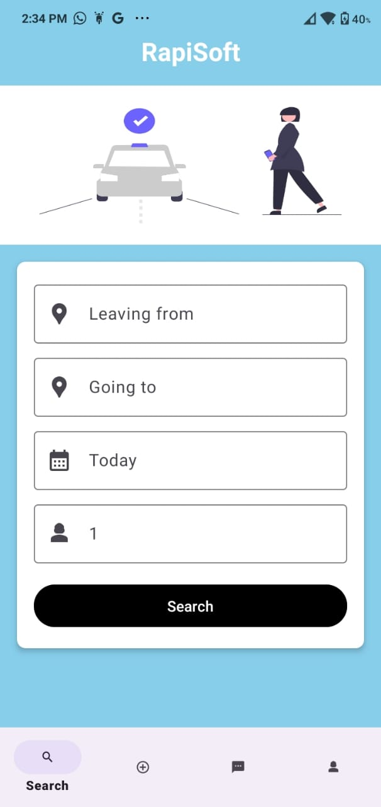
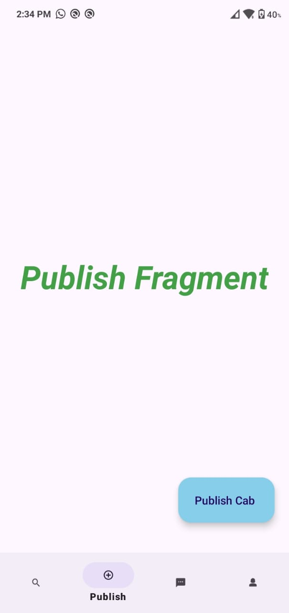
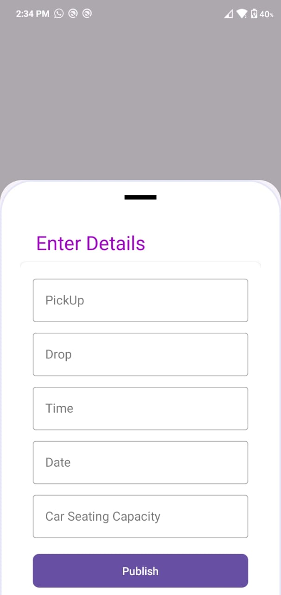

# RapiSoft

**RapiSoft** is a simple yet powerful carpooling app that offers multiple features for both passengers and drivers.   

## Features

- **Search for Cabs**: Easily search for cabs to your destination and specify how many seats you need to book.   
  
- **Publish Your Cab**: If you're a driver, you can publish your own cab by entering details such as the number of available seats, your start destination, and your end destination.   
  
- **Chat Option**: The app includes a chat feature, allowing seamless communication between passengers and drivers.   
  
- **Profile Section**: Manage your profile, track your bookings, and review your ride history all in one place.   

RapiSoft provides a convenient way to carpool, whether you're looking for a ride or offering one!

This is the first Screen Where the user can Book the cab with the required Number of seats and the desired Destination.  

This is the second Screen Where the user (Driver) can publish his cab with nessary details of the cab such as Seats Available, PickUp point, Destination, Time ,Data Etc.  

